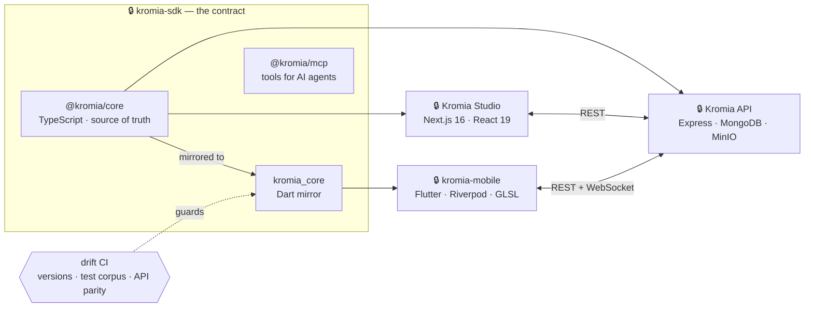
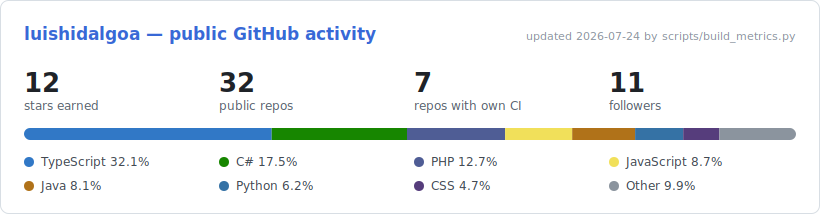

<!-- ══════════════════════ HEADER ══════════════════════ -->

---

I work across the stack, mostly Java and TypeScript, with Flutter on mobile. My current project is **Kromia**: an SDK that owns a shared contract, plus the web studio, REST API and mobile app that consume it.

I also run the infrastructure my projects sit on: authentication, WebSocket sync, GitHub Actions pipelines, and Docker deploys to a Raspberry Pi I maintain at home. Off-hours I'm preparing the **TAI exam**, Spain's national IT civil-service track.

---

## 🧰 Stack

**Languages**

**Frontend**

**Backend & Data**

**DevOps & Observability**

**Testing & Quality**

<b>Full breakdown by area</b>

 

| Area | Technologies |
|---|---|
| **Security / Auth** | Spring Security · JWT (`jjwt`, `jose`, `jsonwebtoken`) · OAuth2 *client · resource server · authorization server* · social login (Google) · authorities and roles · method-level authorization (`@PreAuthorize`/`@PostAuthorize`) · custom filters · CORS/CSRF · Helmet · rate limiting · httpOnly cookies · bcrypt |
| **Real-time** | Socket.IO (Node server and Flutter `socket_io_client`) · JWT-authenticated rooms and events |
| **APIs & contract** | REST · OpenAPI/Swagger (`springdoc`, `zod-to-openapi`) · Zod · schema validation · protocol versioning with automated drift detection |
| **Microservices** | Spring Cloud Gateway · Eureka service discovery · Config Server · OpenFeign · Actuator |
| **Frontend** | Angular 17–19 (SSR, standalone) · Next.js 16 + React 19 · TanStack Query · React Hook Form · Radix UI · Tailwind v4 · Flutter (Riverpod, go_router, GLSL shaders, sensors) · Ionic + Capacitor · Electron |
| **Data** | MongoDB/Mongoose · MySQL · PostgreSQL · SQLite · Prisma (versioned migrations) · Turso/libSQL · MinIO · AWS S3 · Cloudflare R2 |
| **Testing** | TDD · Jest · Vitest · Playwright (e2e) · Supertest · JUnit 5 · Mockito · `spring-security-test` · `mongodb-memory-server` · Karma/Jasmine · `flutter_test` · Husky pre-push hooks |
| **Integrations** | Stripe (subscriptions and webhooks) · Google Gemini API · Nodemailer · i18n (`next-intl`) · QR generation and scanning |

---

## 🚀 Kromia

One SDK owns the contract. The web studio, the API and the mobile app consume it, and CI checks that they stay in sync.

Some of the pipeline work behind it:

- 🍏 **iOS builds on CI.** A `macos-latest` runner compiles the `.ipa`, clones the private SDK with a dedicated PAT, injects the backend URL through `--dart-define`, and attaches the binary to the Release.
- 🛡️ **Drift detection in three layers.** The contract lives in TypeScript and is mirrored in Dart. CI compares versions, runs a cross-language test corpus and checks API parity. When the mirror falls behind, it opens a Jira issue and fails the check.
- 🗺️ **Endpoint map tied to a test.** The test enumerates the Express router and diffs it against the documented map, so adding a route without documenting it fails the PR.
- 📚 **Versioned docs** built with MkDocs Material and deployed to GitHub Pages from Actions.

🔒 = private repository, product in development.

---

## ⚙️ Automation, DevOps & Monitoring

### CI/CD with GitHub Actions

| Pattern | Where and why |
|---|---|
| **Native ARM64 builds** | `ubuntu-24.04-arm` runners build the Raspberry Pi images without QEMU emulation, which used to hang at random and burn the full timeout. |
| **Release-driven** | Only `vX.Y.Z` tags trigger a build and a push to **GHCR**. Plain pushes to `main` don't spend minutes. |
| **Upstream watch cron** | A daily job polls an upstream dependency's releases and rebuilds only when a new version ships, checkpointing the last built version in the repo. |
| **Quality gates** | Drift detection, API documentation checks and tests all run as required PR checks. |
| **Hygiene** | `concurrency` to stop overlapping runs, `timeout-minutes` as a backstop, least-privilege permissions per job, `workflow_dispatch` for manual builds. |

### Deployment to a self-hosted Raspberry Pi

The Pi never compiles. CI pushes the image to GHCR, **Watchtower** notices the new `:latest` and recreates the container within about five minutes. One Watchtower per host, label-driven, so any project can opt in by adding a label. `healthcheck` and `stop_grace_period` keep redeploys from dropping in-flight requests behind the reverse proxy.

### Observability with Prometheus and Grafana

GameHub exposes `GET /api/metrics` in Prometheus text format, which I wrote by hand rather than pulling in a client library. It publishes traffic, average latency, unique and active visitors, downloads and bytes served. `node_exporter` covers host metrics, Loki and Promtail collect the logs, and Grafana reads all three. The endpoint needs a bearer token or a LAN address.

---

## 🤖 Agentic AI

I write MCP servers so agents call my tools through a fixed schema instead of guessing at them.

- **MCP servers in three languages.** TypeScript, exposing an SDK's model as tools over both stdio and HTTP transports. C#, on the .NET Generic Host with the `ModelContextProtocol` package. Node, as a publishable CLI. Each one has its own test suite.
- **Agent rules committed to the repo.** `AGENTS.md` and `CLAUDE.md` set the TDD workflow, versioning policy and ownership boundaries an agent has to work within.
- **Multi-agent orchestration.** Two sessions run in parallel across separate repos, with a defined ownership split, a handoff channel and Jira tracking.
- **Packaged skills** in `.claude/skills/` for driving GitHub Projects.
- **Gemini in production**, with caching, per-user quotas and auditing of the generated output.

---

## 📊 GitHub

<picture>
  <source media="(prefers-color-scheme: dark)" srcset="assets/metrics-dark.svg">
  
</picture>

  

ℹ️ I generate the card above with [my own script](scripts/build_metrics.py), refreshed daily by [a workflow in this repo](.github/workflows/metrics.yml). I switched after two third-party widget services shut down. It only counts public activity; much of my recent work sits in private repositories.

---

## 🌱 Selected public projects

| Project | What it is | Stack |
|---|---|---|
| [**GameHub**](https://github.com/luishidalgoa/GameHub) | Self-hosted library with a filesystem scanner, signed downloads, analytics and the Prometheus exporter above | `Next.js` · `Prisma` · `Docker` · `GHCR` |
| [**Ritmo**](https://github.com/luishidalgoa/Ritmo) | .NET desktop app with a built-in MCP server and automated releases | `C#` · `.NET` · `MCP` |
| [**shrink-studio**](https://github.com/luishidalgoa/shrink-studio) | HEVC video compressor: PowerShell engine, GUI and installer | `C#/WPF` · `PowerShell` · `Inno Setup` |
| [**yt-subs**](https://github.com/luishidalgoa/Subscription-Artists-And-Automatic-download-music) | Channel subscriptions and automatic downloads, deployed to the Pi through GHCR and Watchtower | `Python` · `Docker` · `Actions` |
| [**Project Management System**](https://github.com/luishidalgoa/Project_Management_System) | Collaborative project manager, built with Atmira | `Angular` · `Spring Boot` · `JWT` |

---

## 💼 Experience

**Deuser Tech Group** *(A Minsait Business, Indra group)* · Process automation, dual-training placement · Córdoba · 2024–2025 
Built internal workflow automation on the Microsoft Power Platform: Power Automate flows, Power Apps, and integrations with SharePoint and Outlook. Also delivered a [Laravel web project](https://github.com/luishidalgoa/Laravel_Proyecto_FPDual). Finished with a written recommendation from the company.

**Atmira** · Full-stack developer, DAM work placement · 2024 
Team-built a [project management web app](https://github.com/luishidalgoa/Project_Management_System): Angular 17 frontend with a [Spring Boot + JWT backend](https://github.com/luishidalgoa/Project_Management_System_BackEnd) over MySQL.

**Inper** · IT technician, SMR work placement · 2022 
Hardware maintenance and network installations.

---

## 🎓 Education & Certifications

**Education**

- 📚 **Preparing the TAI exam** (Técnico Auxiliar de Informática, Spain's national IT civil-service exam) — a CS-degree-breadth syllabus: computer architecture, operating systems, networking, databases, security and public-sector IT law. I built the interactive study engine I use for it: [apuntes-sdk](https://github.com/luishidalgoa/apuntes-sdk).
- **Higher Vocational Diploma in Multiplatform Application Development** (CFGS DAM) · IES Francisco de los Ríos, 2022–2024
- **Higher Vocational Diploma in Web Application Development** (CFGS DAW) · IES Francisco de los Ríos, 2024–2025
- **Vocational Diploma in Computer Systems and Networks** (CFGM SMR)

**Certifications**

- 🧠 **Programming for AI and Big Data in 5G Environments** · 150 h, official certificate, Junta de Andalucía / Vodafone 5G Plus · 2026
- 🌐 **Programming for IoT and Smart City Solutions in 5G Environments** · 150 h, official certificate, Junta de Andalucía / Vodafone 5G Plus · 2026
- 🟣 **Apache Kafka** · Academia DavinchiCoder · 2025
- 🔐 [**Spring Security 6: Zero to Master with JWT and OAuth2**](https://ude.my/UC-80427d30-2e7d-4645-82cd-23d567618789) · Udemy, Eazy Bytes · 2024
- 🅰️ [**Angular: De cero a experto**](https://www.udemy.com/certificate/UC-b8661571-511d-4c4e-8b9e-eb7d5e52b964/) and [**JavaScript, HTML5 y CSS3**](https://www.udemy.com/certificate/UC-90b6fd6c-5e30-49a3-9dc1-7b7fadc86d89/) · Udemy

---

### 🤝 Let's talk

